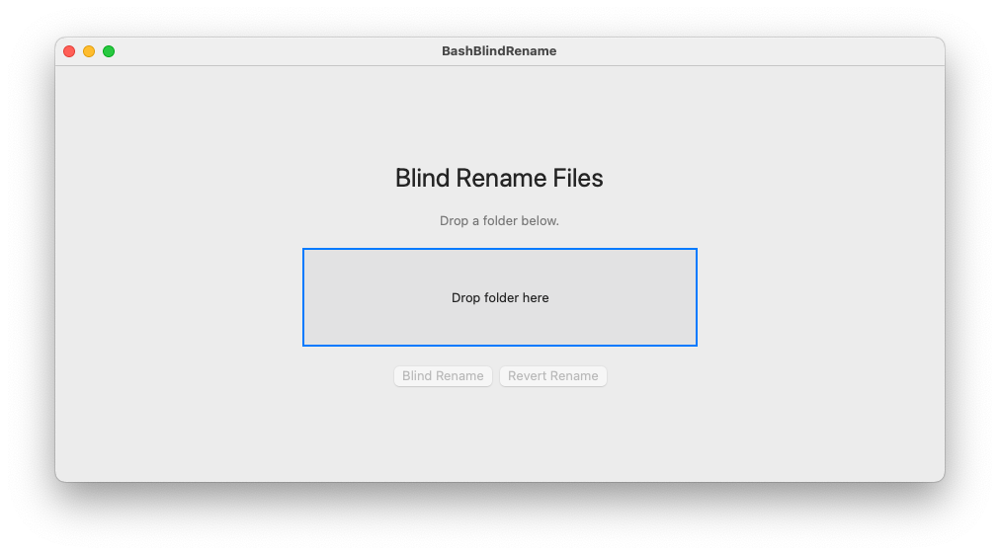

# Blind Rename Files – Swift macOS App & Bash Scripts

[](https://doi.org/10.5281/zenodo.16878966)


A native macOS app (SwiftUI) and Bash scripts to blind-rename files in a folder, saving the mapping of old and new names in a dictionary. Both methods include the ability to revert file names to their original state.

## Choose Your Method

- **Swift macOS App:**
  - User-friendly drag-and-drop interface for macOS 12+.
  - No command line required.
  - See instructions below.
- **Bash Scripts:**
  - Cross-platform (macOS & Linux).
  - Use in terminal for automation or scripting.
  - See Bash Scripts section below.

## Features (Both Methods)

- Generates pseudo-random, uppercase alphanumeric filenames using SHA256 (Swift) or shasum (Bash).
- Prevents destructive outcomes: will not overwrite or re-randomize folders already processed.
- Ignores `name_dictionary.csv` and `Analysis_file.csv` during renaming.
- Preserves file extensions.
- Only processes files in the selected folder (does not recurse into subfolders).
- Reduces risk of filename collisions by using a hash of the filename.
- Detects if a folder has been previously obfuscated (checks for `name_dictionary_DEPRECATED.csv`).
- Creates `Analysis_file.csv` with only new names for manual analysis.
- Handles filenames and folder names with spaces or special characters.
- Revert function restores original names and deprecates the dictionary.

## Swift macOS App



### Requirements

- macOS 12 or later
- Xcode 13 or later

### Usage

1. **Open the Project:**
   - Open `BashBlindRename.xcodeproj` in Xcode.
2. **Build & Run:**
   - Select your Mac as the run target.
   - Click the ▶️ (Run) button or press `Cmd + R`.
3. **Using the App:**
   - Drag and drop a folder onto the app window.
   - Click **Blind Rename** to obfuscate file names in the folder.
   - Click **Revert Rename** to restore original file names (if `name_dictionary.csv` is present).
   - The app will create `name_dictionary.csv` and `Analysis_file.csv` in the selected folder.
   - After reverting, the dictionary is renamed to `name_dictionary_DEPRECATED.csv`.

## Bash Scripts

### Requirements

- Bash (macOS or Linux)
- `shasum` utility (pre-installed on most systems)

### Usage

1. Make the scripts executable:
   ```bash
   chmod +x bash_blind_rename.sh
   chmod +x revert_rename.sh
   ```
2. To obfuscate the names in a folder (e.g., `temp/`):
   ```bash
   ./bash_blind_rename.sh temp/
   ```
3. To revert file names:
   ```bash
   ./revert_rename.sh temp/
   ```

## Example

**Before:**

```
   Mac:user$ ls -lF temp/
	total 0
	-rw-r--r--   1 et  staff    0 May  4 21:56 foo_1.txt    
	-rw-r--r--   1 et  staff    0 May  4 21:56 foo_10.txt    
	-rw-r--r--   1 et  staff    0 May  4 21:56 foo_2.txt    
	-rw-r--r--   1 et  staff    0 May  4 21:56 foo_3.txt    
	-rw-r--r--   1 et  staff    0 May  4 21:56 foo_4.txt   
	-rw-r--r--   1 et  staff    0 May  4 21:56 foo_5.txt   
	-rw-r--r--   1 et  staff    0 May  4 21:56 foo_6.txt    
	-rw-r--r--   1 et  staff    0 May  4 21:56 foo_7.txt    
	-rw-r--r--   1 et  staff    0 May  4 21:56 foo_8.txt   
	-rw-r--r--   1 et  staff    0 May  4 21:56 foo_9.txt    
	drwxr-xr-x  12 et  staff  408 May  4 21:56 subfolder/     
	
	Mac:Bash_blind_renamer user$ ls -lF temp/subfolder/
	total 0
	-rw-r--r--  1 et  staff  0 May  4 21:56 bar_1.txt
	-rw-r--r--  1 et  staff  0 May  4 21:56 bar_10.txt
	-rw-r--r--  1 et  staff  0 May  4 21:56 bar_2.txt
	-rw-r--r--  1 et  staff  0 May  4 21:56 bar_3.txt
	-rw-r--r--  1 et  staff  0 May  4 21:56 bar_4.txt
	-rw-r--r--  1 et  staff  0 May  4 21:56 bar_5.txt
	-rw-r--r--  1 et  staff  0 May  4 21:56 bar_6.txt
	-rw-r--r--  1 et  staff  0 May  4 21:56 bar_7.txt
	-rw-r--r--  1 et  staff  0 May  4 21:56 bar_8.txt
	-rw-r--r--  1 et  staff  0 May  4 21:56 bar_9.txt
```


**After Blind Rename:**


```
Mac:Bash_blind_renamer user$ ls -lF temp/
total 8
-rw-r--r--   1 et  staff    0 May  4 21:56 007937B3F4F4D9F58B7D.txt
-rw-r--r--   1 et  staff    0 May  4 21:56 0A8894E19F79239FE547.txt
-rw-r--r--   1 et  staff    0 May  4 21:56 13840CB7444D948C078B.txt
-rw-r--r--   1 et  staff    0 May  4 21:56 36372FE3EFD9EAA7A04D.txt
-rw-r--r--   1 et  staff    0 May  4 21:56 36F6B95EC8138AE7A2E0.txt
-rw-r--r--   1 et  staff    0 May  4 21:56 3C27A89C60DE090DE1F6.txt
-rw-r--r--   1 et  staff    0 May  4 21:56 760A83AE04023DD099FC.txt
-rw-r--r--   1 et  staff    0 May  4 21:56 7F4C851ECC1AC1FDE5DF.txt
-rw-r--r--   1 et  staff    0 May  4 21:56 C2075C3D1E404186C675.txt
-rw-r--r--   1 et  staff    0 May  4 21:56 F27A8053EDC3CCE651A2.txt
-rw-r--r--   1 et  staff  367 May  4 22:01 name_dictionary.csv
drwxr-xr-x  12 et  staff  408 May  4 21:56 subfolder/

Mac:Bash_blind_renamer user$ ls -lF temp/subfolder/
total 0
-rw-r--r--  1 et  staff  0 May  4 21:56 bar_1.txt
-rw-r--r--  1 et  staff  0 May  4 21:56 bar_10.txt
-rw-r--r--  1 et  staff  0 May  4 21:56 bar_2.txt
-rw-r--r--  1 et  staff  0 May  4 21:56 bar_3.txt
-rw-r--r--  1 et  staff  0 May  4 21:56 bar_4.txt
-rw-r--r--  1 et  staff  0 May  4 21:56 bar_5.txt
-rw-r--r--  1 et  staff  0 May  4 21:56 bar_6.txt
-rw-r--r--  1 et  staff  0 May  4 21:56 bar_7.txt
-rw-r--r--  1 et  staff  0 May  4 21:56 bar_8.txt
-rw-r--r--  1 et  staff  0 May  4 21:56 bar_9.txt
```


Subfolders are not affected.

## Notes

- Do **not** run the app or scripts on folders containing critical system files.
- If `name_dictionary.csv` or `Analysis_file.csv` exists, the app/scripts will not run to prevent accidental overwrites.
- If `name_dictionary_DEPRECATED.csv` exists, delete it before running again.

## License

See [LICENSE](LICENSE).
Icon from Uicons by <a href="https://www.flaticon.com/uicons">Flaticon</a>

---

*Contributions welcome!*
