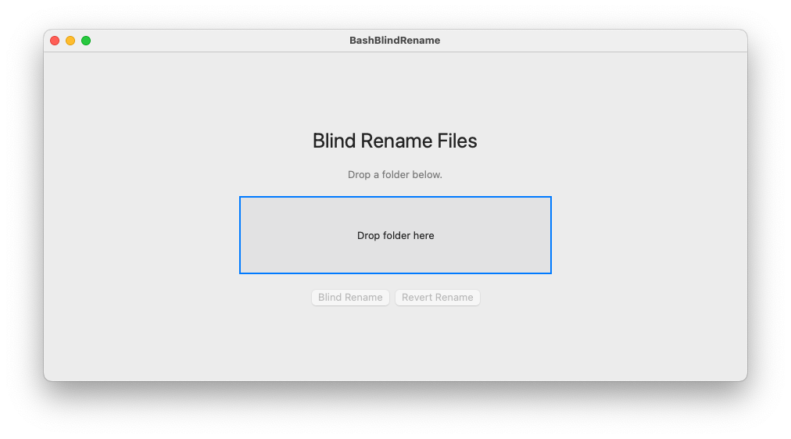

[](https://doi.org/10.5281/zenodo.16878966)
[](https://github.com/ToledoEM/Bash-blind-rename)

A macOS app and Bash scripts to blind-rename files in a folder for unbiased analysis. Original filenames are saved in a dictionary so they can be restored at any time.

---

## What it does

Each file in a folder is renamed to a 20-character uppercase hash derived from its original filename. A `name_dictionary.csv` mapping is saved alongside the files. Running the revert restores all original names and archives the dictionary.

Files created in the folder:

| File | Purpose |
|---|---|
| `name_dictionary.csv` | Maps original names to obfuscated names |
| `Analysis_file.csv` | List of obfuscated names only, for use during blind analysis |
| `name_dictionary_DEPRECATED.csv` | Renamed from dictionary after a successful revert |

: {tbl-colwidths="[35,65]"}

Subfolders are never touched.

---

## macOS App



Download `BashBlindRename.app` from the [releases page](https://github.com/ToledoEM/Bash-blind-rename/releases).

::: {.callout-note}
Requires macOS 12 or later. No installation — double-click and run.
:::

1. Open the app.
2. Drag and drop your folder onto the drop zone.
3. Click **Blind Rename** to obfuscate filenames.
4. Click **Revert Rename** to restore original names.

---

## Bash Scripts

### Requirements

- Bash (macOS or Linux)
- `shasum` — pre-installed on macOS and most Linux systems

### Setup

```bash
chmod +x bash_blind_rename.sh revert_rename.sh
```

### Blind rename a folder

```bash
./bash_blind_rename.sh path/to/folder
```

### Revert to original names

```bash
./revert_rename.sh path/to/folder
```

---

## Example

**Starting folder:**

```bash
temp/
  foo_1.txt
  foo_2.txt
  foo_3.txt
  subfolder/
    bar_1.txt
```

**After `./bash_blind_rename.sh temp/`:**

```bash
temp/
  007937B3F4F4D9F58B7D.txt
  3C27A89C60DE090DE1F6.txt
  760A83AE04023DD099FC.txt
  name_dictionary.csv
  Analysis_file.csv
  subfolder/
    bar_1.txt
```

`subfolder/` and its contents are untouched.

**`name_dictionary.csv`:**

```bash
Oldname,Newname
foo_1.txt,007937B3F4F4D9F58B7D.txt
foo_2.txt,3C27A89C60DE090DE1F6.txt
foo_3.txt,760A83AE04023DD099FC.txt
```

**After `./revert_rename.sh temp/`:**

```bash
temp/
  foo_1.txt
  foo_2.txt
  foo_3.txt
  name_dictionary_DEPRECATED.csv
  subfolder/
    bar_1.txt
```

---

## Safety rules

::: {.callout-warning}
- Will not run if `name_dictionary.csv` or `Analysis_file.csv` already exist in the folder.
- Will not run if `name_dictionary_DEPRECATED.csv` exists — delete it first to re-run.
- Does not run as root/superuser.
- Does not recurse into subfolders.
:::

---

## License

See [LICENSE](../LICENSE).
